# Building a Production ML Pipeline: Feast + Kubeflow + MLflow + KServe

*A blueprint for scalable ML pipelines that eliminate feature skew from training to serving*

**By Abhijeet Dhumal and Nikhil Kathole**

---

Machine learning has moved far beyond experimental notebooks. Today, enterprises deploy models that drive real business decisions—from demand forecasting and fraud detection to personalized recommendations and predictive maintenance. Yet the path from a working prototype to a reliable production system remains fraught with challenges that have little to do with model architecture or hyperparameter tuning.

Google's seminal paper [Hidden Technical Debt in Machine Learning Systems](https://papers.nips.cc/paper/2015/file/86df7dcfd896fcaf2674f757a2463eba-Paper.pdf) (NIPS 2015) established that ML systems incur massive ongoing maintenance costs—not from model code, but from data dependencies, configuration complexity, and the erosion of abstraction boundaries. The reality is that most ML failures in production stem from data inconsistencies, not algorithmic issues. This phenomenon, known as [training-serving skew](https://developers.google.com/machine-learning/guides/rules-of-ml#training-serving_skew), occurs when features are computed differently during training versus inference—often due to inconsistent logic implementations across languages, systems, or data pipelines.

Industry leaders learned this lesson through costly experience. [Uber](https://www.uber.com/blog/michelangelo-machine-learning-platform/) built Michelangelo specifically to solve feature consistency after experiencing model degradation. [DoorDash](https://doordash.engineering/2020/11/19/building-a-gigascale-ml-feature-store-with-redis/) reported significant prediction errors in delivery time estimates before implementing their feature store. [Netflix](https://netflixtechblog.com/distributed-time-travel-for-feature-generation-389cccdd3907) developed distributed time travel for feature generation to enable offline testing with historical data. [Airbnb](https://medium.com/airbnb-engineering/chronon-a-declarative-feature-engineering-framework-b7b8ce796e04) created Chronon, a declarative feature engineering framework, to centralize feature computation for both training and inference. [Atlassian](https://tecton.ai/customers/atlassian) reduced feature deployment from months to days while improving data consistency from 96% to 99.9% after adopting a feature platform.

Feature stores have emerged as critical infrastructure to address these challenges, providing a single source of truth for feature definitions that both training and serving can rely on. Combined with distributed training frameworks that scale across multiple nodes and accelerators, experiment tracking systems that ensure reproducibility, and serving platforms that handle auto-scaling and traffic management, organizations can build ML pipelines that are robust, scalable, and maintainable.

This article walks you through building a complete ML pipeline for retail demand forecasting—a challenge that costs the industry dearly when done poorly. According to [IHL Group research](https://www.ihlservices.com/news/analyst-corner/2025/09/retail-inventory-crisis-persists-despite-172-billion-in-improvements/), global retailers lose approximately **\$1.77 trillion annually** due to inventory distortion—out-of-stocks account for \$1.2 trillion in lost sales, while overstocking costs another \$562 billion in markdowns and waste.

Our use case is inspired by the [Walmart Store Sales Forecasting](https://www.kaggle.com/c/walmart-recruiting-store-sales-forecasting) challenge on Kaggle and draws from techniques used in the [M5 Forecasting Competition](https://www.kaggle.com/competitions/m5-forecasting-accuracy)—the largest retail forecasting benchmark to date, featuring 42,840 hierarchical time series of Walmart unit sales. We predict weekly sales across multiple stores and departments using historical patterns, temporal features, and economic indicators.

To build this pipeline, we use [Red Hat OpenShift AI](https://www.redhat.com/en/technologies/cloud-computing/openshift/openshift-ai), which provides a comprehensive platform for the complete ML lifecycle by integrating open source projects and operators. This article demonstrates a subset of its capabilities:

- **[Feast](https://docs.feast.dev/)** for feature management — with [PostgreSQL](https://www.postgresql.org/) for registry, [Redis](https://redis.io/) for online serving, and [Ray](https://docs.ray.io/) for distributed offline computations
- **[Kubeflow Training Operator](https://www.kubeflow.org/docs/components/training/)** for distributed training — supporting both NVIDIA ([CUDA](https://developer.nvidia.com/cuda-toolkit)/[NCCL](https://developer.nvidia.com/nccl)) and AMD ([ROCm](https://www.amd.com/en/products/software/rocm.html)/[RCCL](https://github.com/ROCm/rccl)) accelerators
- **[MLflow](https://mlflow.org/)** for experiment tracking and model registry
- **[KServe](https://kserve.github.io/website/)** for auto-scaling model serving

Most importantly, we show how the same feature definitions power both training and inference, eliminating the training-serving skew that plagues production ML systems.

---

## TL;DR

This blueprint combines five technologies to build a production-ready ML pipeline:

| Component | Purpose |
|-----------|---------|
| **Feast** | Single source of truth for features (training + serving) |
| **Ray** | Distributed feature retrieval that scales to millions of rows |
| **Kubeflow Trainer** | Multi-node PyTorch DDP training |
| **MLflow** | Experiment tracking and model registry |
| **KServe** | Auto-scaling model serving with Feast integration |

---

## The Problem: Training-Serving Skew

The pattern across industries is consistent: **models that work perfectly in notebooks fail silently in production** because feature computation differs between training and serving. As discussed above, this problem drove Uber, DoorDash, Netflix, Airbnb, and Atlassian to invest heavily in feature platforms.

### What Goes Wrong Without a Feature Store

| Failure Mode | Symptom | Business Impact |
|--------------|---------|-----------------|
| **Stale features** | Serving uses yesterday's data while training used point-in-time | Predictions drift over time |
| **Different aggregations** | Training computes rolling averages differently than serving | Model accuracy drops |
| **Missing features** | Serving code omits a feature that training included | Silent prediction errors |
| **Type mismatches** | Training uses float64, serving uses float32 | Subtle numerical differences |

---

## Architecture Overview


*Complete pipeline flow: Feature Engineering → Distributed Training → Model Serving. The same FeatureService definitions power both training and inference.*

The architecture separates concerns across five components that work together seamlessly on OpenShift AI:

| Component | Role |
|-----------|------|
| **Feast Operator** | Manages feature store infrastructure (registry, online/offline stores) |
| **Ray (KubeRay)** | Distributed `get_historical_features()` — scales to millions of rows |
| **Kubeflow Trainer** | Multi-node PyTorch Distributed Training orchestration |
| **MLflow Operator** | Experiment tracking with workspace isolation |
| **KServe** | Auto-scaling inference with Feast SDK integration |

---

## Getting Started on OpenShift AI

Before diving into the ML pipeline phases, let's set up the environment on OpenShift AI.

### Step 1: Access OpenShift AI

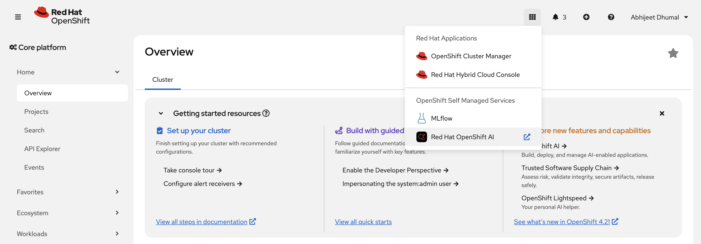
*Navigate to OpenShift AI from the OpenShift console.*

### Step 2: Create a Data Science Project

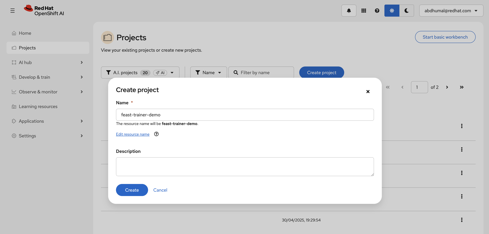
*Create a new Data Science Project to organize your ML resources.*

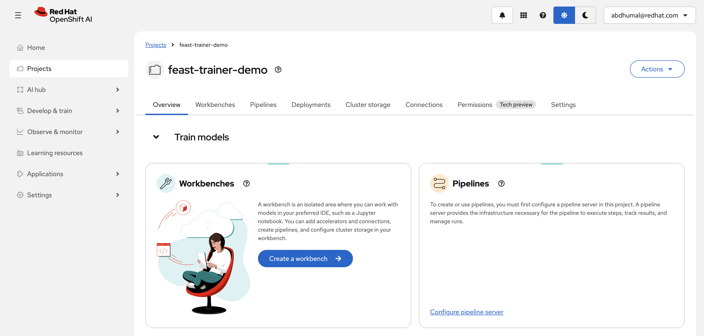
*OpenShift AI Data Science Project with all components configured.*

### Step 3: Configure Storage

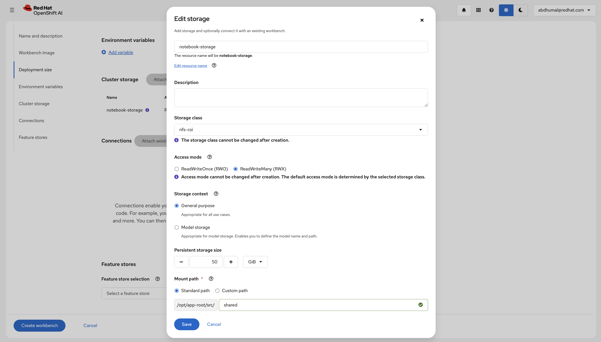
*Attach persistent storage for model artifacts and datasets.*

### Step 4: Create a Workbench

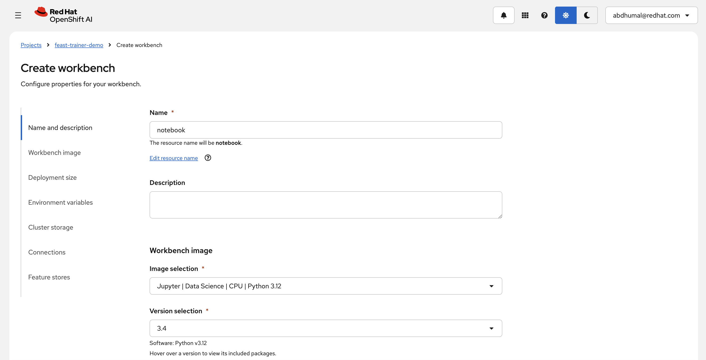
*Select an appropriate workbench image with pre-installed ML libraries.*

### Step 5: Connect to Feature Store

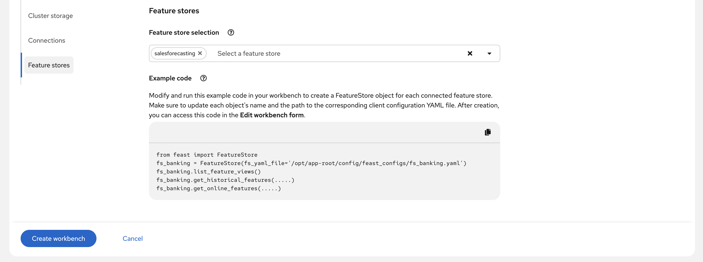
*Connect the workbench to the Feast feature store for seamless feature access.*

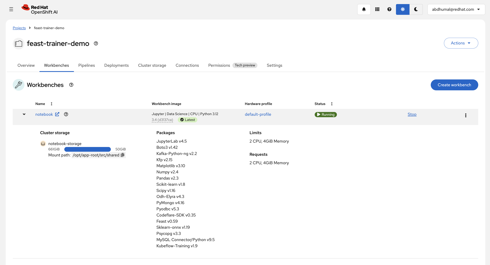
*Jupyter workbench connected to Feast feature store and shared storage.*

### Prerequisites

| Component | Purpose |
|-----------|---------|
| OpenShift AI | Managed ML platform |
| Feast Operator | Feature store infrastructure |
| Kubeflow Training Operator | Distributed training |
| KServe | Model serving |
| MLflow Operator | Experiment tracking |

---

## Phase 1: Feature Engineering with Feast

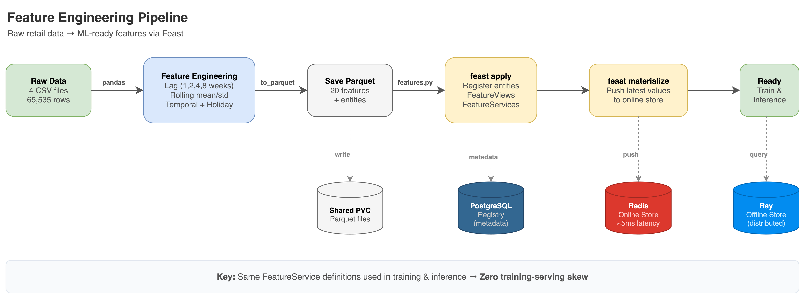
*Feature engineering workflow: Generate data → Engineer features → Register with Feast → Materialize to online store.*

### The Feast Operator Advantage

On OpenShift AI, the **Feast Operator** automates feature store infrastructure:

| What It Manages | Benefit |
|-----------------|---------|
| **PostgreSQL Registry** | Durable metadata storage for feature definitions |
| **Redis Online Store** | Low-latency feature serving |
| **Ray Offline Store** | Distributed historical feature retrieval |
| **gRPC Services** | Secure communication between components |
| **Client ConfigMaps** | Auto-generated configuration (auto-mounted in workbenches, manually mounted in jobs) |

When you create a FeatureStore custom resource, the operator provisions all components and generates client configuration that workbenches can mount automatically.

**FeatureStore Custom Resource:**

```yaml
apiVersion: feast.dev/v1
kind: FeatureStore
metadata:
  name: salesforecasting
  namespace: feast-trainer-demo
spec:
  feastProject: sales_forecasting
  
  # Feature definitions from Git repository
  feastProjectDir:
    git:
      url: https://github.com/your-org/sales-demand-forecasting.git
      ref: main
      featureRepoPath: feature_repo
  
  services:
    # Offline Store: Ray for distributed historical queries
    offlineStore:
      persistence:
        store:
          type: ray
          secretRef:
            name: feast-data-stores
    
    # Online Store: Redis for low-latency serving
    onlineStore:
      persistence:
        store:
          type: redis
          secretRef:
            name: feast-data-stores
    
    # Registry: PostgreSQL for durable metadata
    registry:
      local:
        persistence:
          store:
            type: sql
            secretRef:
              name: feast-data-stores
```

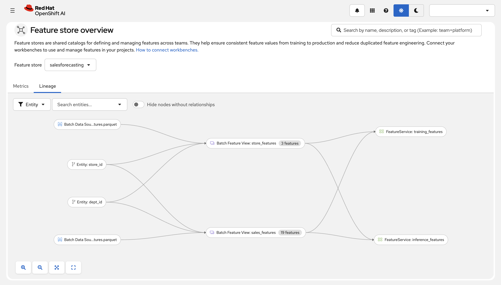
*Feast UI showing feature lineage from data sources → entities → feature views → feature services.*

### Feature Services: The Key to Consistency

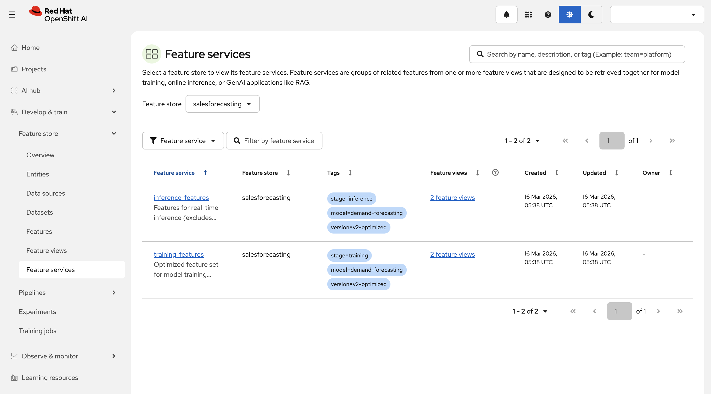
*Feature Services define which features are used for training vs inference.*

The critical insight is creating **two FeatureServices** that share the same feature definitions but differ in one key aspect:

| Service | Purpose | Includes `weekly_sales` (Target)? |
|---------|---------|-----------------------------------|
| `training_features` | Historical feature retrieval for model training | **Yes** - model learns to predict this |
| `inference_features` | Real-time feature lookup for predictions | **No** - this is what we're predicting |

```python
# Training FeatureService - includes target column
training_features = FeatureService(
    name="training_features",
    features=[
        sales_features[[
            "weekly_sales",  # Target - only in training
            "lag_1", "lag_2", "lag_4", "lag_8",
            "rolling_mean_4w", "rolling_std_4w", "sales_vs_avg",
            "week_of_year", "month", "quarter", "is_holiday",
            "temperature", "fuel_price", "cpi", "unemployment",
        ]],
        store_features[["store_type", "store_size", "region"]],
    ],
)

# Inference FeatureService - excludes target column
inference_features = FeatureService(
    name="inference_features",
    features=[
        sales_features[[
            # No weekly_sales - that's what we predict!
            "lag_1", "lag_2", "lag_4", "lag_8",
            "rolling_mean_4w", "rolling_std_4w", "sales_vs_avg",
            "week_of_year", "month", "quarter", "is_holiday",
            "temperature", "fuel_price", "cpi", "unemployment",
        ]],
        store_features[["store_type", "store_size", "region"]],
    ],
)
```

**Features included in both services:**

| Category | Features | Importance |
|----------|----------|------------|
| **Target** | `weekly_sales` | Training only - the value we predict |
| **Lag** | `lag_1`, `lag_2`, `lag_4`, `lag_8` | 35% - historical sales patterns |
| **Rolling** | `rolling_mean_4w`, `rolling_std_4w`, `sales_vs_avg` | 28% - recent trends |
| **Temporal** | `week_of_year`, `month`, `quarter`, `week_of_month`, `is_month_end` | 18% - seasonality |
| **Holiday** | `is_holiday`, `days_to_holiday` | 10% - holiday effects |
| **Economic** | `temperature`, `fuel_price`, `cpi`, `unemployment` | 7% - external factors |
| **Store** | `store_type`, `store_size`, `region` | 2% - static metadata |

Both services reference the **same underlying feature definitions**, ensuring that:
- Training and serving use identical feature computations
- The target (`weekly_sales`) is only included during training
- Feature updates propagate to both training and serving automatically

---

## Phase 2: Distributed Training with Kubeflow

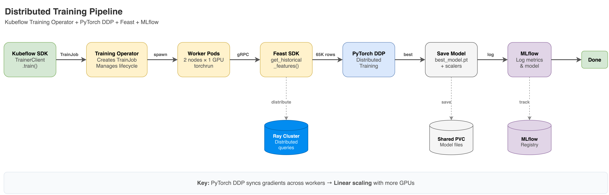
*Training workflow: Submit TrainJob → Fetch features via Feast SDK → Distributed training → Log to MLflow.*

### Why Kubeflow Trainer?

Distributed training on Kubernetes is complex. Without an operator, you'd manually configure:
- Environment variables (`MASTER_ADDR`, `WORLD_SIZE`, `RANK`) for each pod
- Pod scheduling for network locality
- Job lifecycle (restarts, failures, gang scheduling)
- Headless services for pod-to-pod communication
- Multi-GPU allocation and NCCL/RCCL configuration
- Accelerator-specific settings (CUDA for NVIDIA, ROCm for AMD)

The **Kubeflow Trainer** handles all of this declaratively, supporting:

| Capability | Description |
|------------|-------------|
| **Multi-node training** | Scale across 2, 4, 8, or 100+ nodes |
| **Multi-GPU per node** | Utilize all GPUs on each node (1, 2, 4, 8 GPUs) |
| **Multi-accelerator support** | NVIDIA (CUDA/NCCL) and AMD (ROCm/RCCL) |
| **Automatic coordination** | Environment variables and service discovery handled automatically |

**PyTorch DDP Initialization (handled automatically by Kubeflow):**

```python
import torch.distributed as dist
from torch.nn.parallel import DistributedDataParallel as DDP

# Kubeflow sets MASTER_ADDR, WORLD_SIZE, RANK automatically
dist.init_process_group(backend="nccl" if torch.cuda.is_available() else "gloo")
rank, world_size = dist.get_rank(), dist.get_world_size()

# Each rank gets its own GPU
device = torch.device(f"cuda:{os.environ.get('LOCAL_RANK', 0)}")
model = MLP(input_dim).to(device)
model = DDP(model)  # Wrap for distributed training

# DistributedSampler ensures each rank processes different data
sampler = DistributedSampler(train_dataset, num_replicas=world_size, rank=rank)
train_loader = DataLoader(train_dataset, batch_size=64, sampler=sampler)
```

### Training Pattern

The training workflow follows a proven pattern:

| Step | Component | Action |
|------|-----------|--------|
| 1 | Kubeflow SDK | Submit TrainJob to cluster |
| 2 | Feast SDK | Retrieve historical features via gRPC |
| 3 | PyTorch DDP | Distribute training across nodes |
| 4 | MLflow | Track experiments, log model |
| 5 | Shared Storage | Save artifacts for serving |

**Fetching Historical Features with Feast SDK:**

```python
from feast import FeatureStore
from datetime import datetime, timezone, timedelta

# Initialize Feast with operator-provided config
store = FeatureStore(repo_path="/opt/app-root/src/feast-config/salesforecasting")

# Build entity DataFrame (store_id, dept_id, timestamp)
entity_df = pd.DataFrame([
    {"store_id": s, "dept_id": d, "event_timestamp": datetime(2022, 1, 1, tzinfo=timezone.utc) + timedelta(weeks=w)}
    for w in range(104) for s in range(1, 46) for d in range(1, 15)
])

# Retrieve historical features via Feast gRPC (Ray distributes the query)
df = store.get_historical_features(
    entity_df=entity_df,
    features=store.get_feature_service("training_features")
).to_df()

# df now contains all features + weekly_sales target
X = df[feature_columns].values
y = df["weekly_sales"].values
```

### MLflow Integration

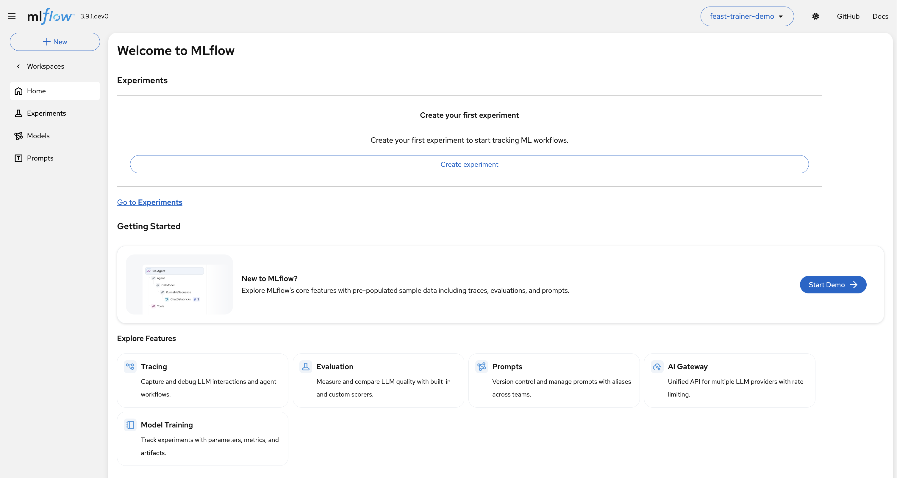
*MLflow workspace in OpenShift AI for experiment tracking.*

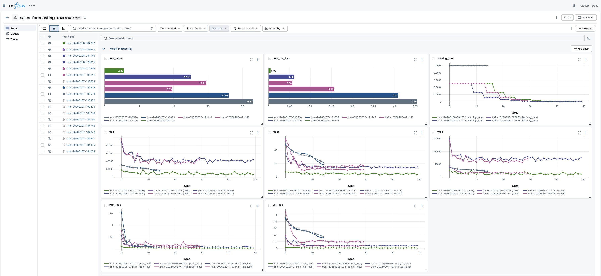
*MLflow UI comparing training runs across different configurations.*

The MLflow Operator on OpenShift AI provides:

| Feature | Benefit |
|---------|---------|
| **Workspace Isolation** | Each team/project gets isolated experiment tracking |
| **Model Registry** | Version and stage models for deployment |
| **Artifact Storage** | Automatic model and scaler persistence |
| **Parameter Logging** | Track hyperparameters across runs |

Each training run automatically logs parameters, metrics (loss, MAPE), and artifacts (model weights, scalers, metadata).

### Scaling Training

The same training configuration scales from development to production:

| Scale | Configuration | Use Case |
|-------|---------------|----------|
| **Development** | 1 node, CPU | Debugging, quick iteration |
| **Team** | 2-4 nodes, GPU | Regular training runs |
| **Production** | 8-64 nodes | Large models, hyperparameter sweeps |

**Submitting a TrainJob with Kubeflow SDK:**

```python
from kubeflow.trainer import TrainerClient, CustomTrainer

trainer = TrainerClient()

# Submit distributed training job
trainer.train(
    trainer=CustomTrainer(
        func=train_fn,                    # Your training function
        num_nodes=4,                      # Scale to 4 nodes
        resources_per_node={
            "gpu": 1,                     # 1 GPU per node
            "cpu": 4,
            "memory": "16Gi"
        },
        packages_to_install=["feast", "mlflow", "torch"],
    ),
    namespace="feast-trainer-demo",
    env={
        "FEAST_CONFIG_PATH": "/opt/app-root/src/feast-config/salesforecasting",
        "MLFLOW_TRACKING_URI": "https://mlflow.apps.cluster.local",
    },
)
```

**TrainJob YAML (declarative alternative):**

```yaml
apiVersion: trainer.kubeflow.org/v1alpha1
kind: TrainJob
metadata:
  name: sales-training
  namespace: feast-trainer-demo
spec:
  runtimeRef:
    name: torch-distributed
    kind: ClusterTrainingRuntime
  trainer:
    image: quay.io/modh/training:py312-cuda128-torch280
    numNodes: 2
    numProcPerNode: 1
    resourcesPerNode:
      requests:
        cpu: "2"
        memory: "4Gi"
      limits:
        cpu: "4"
        memory: "8Gi"
    env:
    - name: FEAST_CONFIG_PATH
      value: /opt/app-root/src/feast-config/salesforecasting
    - name: MLFLOW_TRACKING_URI
      value: "http://mlflow.feast-trainer-demo.svc.cluster.local:5000"
    - name: NUM_EPOCHS
      value: "50"
  podTemplateOverrides:
  - targetJobs:
    - name: node
    spec:
      volumes:
      - name: feast-config
        configMap:
          name: feast-salesforecasting-client  # Created by Feast Operator
      containers:
      - name: node
        volumeMounts:
        - name: feast-config
          mountPath: /opt/app-root/src/feast-config/salesforecasting
```

> **Note**: The `feast-salesforecasting-client` ConfigMap is created by the Feast Operator when you deploy the FeatureStore CR. In **workbenches**, this is auto-mounted when you connect to the feature store via the OpenShift AI UI. For **TrainJobs and InferenceServices**, you must explicitly mount it as shown above.

---

## Phase 3: Model Serving with KServe

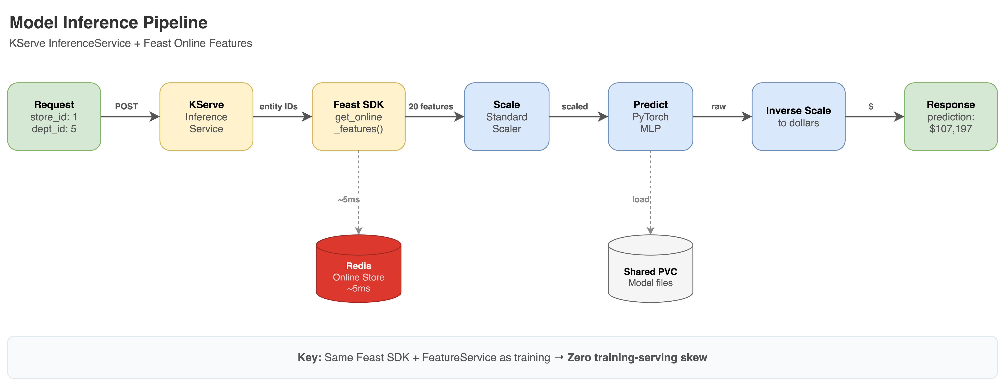
*Inference workflow: Client sends entity IDs → KServe fetches features from Feast → Model predicts → Return result.*

### The Serving Pattern

The key innovation is **Feast SDK integration** in the serving layer:

| Step | Component | Action |
|------|-----------|--------|
| 1 | Client | Sends entity IDs (store_id, dept_id) |
| 2 | KServe | Receives inference request |
| 3 | Feast SDK | Fetches features via gRPC (same as training) |
| 4 | Model | Scales features, runs inference |
| 5 | KServe | Returns prediction |

**Fetching Online Features in KServe Model:**

```python
from feast import FeatureStore
from kserve import Model

class SalesForecastModel(Model):
    def load(self):
        # Same Feast SDK, same config path as training
        self.feast_store = FeatureStore(repo_path="/opt/app-root/src/feast-config/salesforecasting")
        self.model = torch.load("best_model.pt")
    
    def preprocess(self, payload):
        # Client sends only entity IDs
        entities = payload["inputs"][0]["data"]  # [{"store_id": 1, "dept_id": 5}, ...]
        
        # Fetch features from Redis online store via Feast SDK
        features = self.feast_store.get_online_features(
            entity_rows=entities,
            features=self.feast_store.get_feature_service("inference_features")
        ).to_dict()
        
        return self._build_feature_matrix(features)
    
    def predict(self, X):
        X_scaled = self.scaler.transform(X)
        with torch.no_grad():
            return self.model(torch.FloatTensor(X_scaled)).numpy()
```

### Why This Matters

| Approach | Client Sends | Pros | Cons |
|----------|--------------|------|------|
| **Without Feast** | All features | Simple server | Feature drift, complex client |
| **With Feast** | Entity IDs only | No drift, simple client | Requires online store |

By fetching features at serving time using the **same Feast SDK** as training, we guarantee identical feature computation.

**InferenceService YAML:**

```yaml
apiVersion: serving.kserve.io/v1beta1
kind: InferenceService
metadata:
  name: sales-forecast
  namespace: feast-trainer-demo
  annotations:
    serving.kserve.io/deploymentMode: RawDeployment
spec:
  predictor:
    minReplicas: 1
    maxReplicas: 3
    containers:
    - name: kserve-container
      image: quay.io/modh/training:py312-cuda128-torch280
      env:
      - name: MODEL_DIR
        value: /shared/models
      - name: FEAST_CONFIG_PATH
        value: /opt/app-root/src/feast-config/salesforecasting
      resources:
        requests:
          cpu: "500m"
          memory: "2Gi"
      volumeMounts:
      - name: model-storage
        mountPath: /shared
      - name: feast-config
        mountPath: /opt/app-root/src/feast-config/salesforecasting
    volumes:
    - name: model-storage
      persistentVolumeClaim:
        claimName: shared
    - name: feast-config
      configMap:
        name: feast-salesforecasting-client  # Created by Feast Operator
```

### Latency Components

The end-to-end inference latency is composed of:

| Component | Description |
|-----------|-------------|
| Feast online store lookup | Redis-backed feature retrieval |
| Feature scaling | NumPy vectorized operations |
| Model inference | PyTorch forward pass |

Using Redis as the online store ensures low-latency feature retrieval suitable for real-time serving.

---

## Benefits

| Area | Benefit |
|------|---------|
| **Feature Consistency** | Same feature definitions for training and serving eliminates skew |
| **Scalability** | Ray distributes feature retrieval; Kubeflow distributes training |
| **Reduced Training Time** | Multi-node DDP significantly reduces iteration time vs single-node |
| **Low-Latency Serving** | Redis online store enables real-time predictions |
| **Reproducibility** | MLflow tracks all experiments, parameters, and artifacts |

---

## Why This Architecture Works

| Decision | Benefit |
|----------|---------|
| **Feast as single source of truth** | Same FeatureService for training + serving = no skew |
| **Feast Operator** | Automated infrastructure, secure gRPC communication |
| **Ray offline store** | Scales point-in-time joins from thousands to millions of rows |
| **Kubeflow Trainer** | Declarative distributed training, no manual coordination |
| **MLflow Operator** | Workspace isolation, model versioning |
| **KServe + Feast SDK** | Consistent feature retrieval at inference time |

### Comparison with Alternatives

| Approach | Scales | No Skew | Open Source | Vendor Lock-in |
|----------|--------|---------|-------------|----------------|
| Pandas + custom serving | ❌ | ❌ | ✅ | None |
| **Tecton** | ✅ | ✅ | ❌ | High |
| **Vertex AI Feature Store** | ✅ | ✅ | ❌ | GCP |
| **SageMaker Feature Store** | ✅ | ✅ | ❌ | AWS |
| **This Architecture** | ✅ | ✅ | ✅ | None |

The open-source stack provides managed-service capabilities while running on any Kubernetes cluster.

---

## Conclusion

Feature stores aren't just about organizing data—they're about **preventing the silent failures that plague production ML systems**.

This architecture provides:

- **Zero training-serving skew** by construction (same FeatureService definitions)
- **Horizontal scalability** from prototype to production
- **No vendor lock-in** — runs on any Kubernetes cluster
- **GitOps-friendly** — feature definitions are version-controlled

The key insight: **feature consistency between training and serving** is the foundation everything else builds on. Get this wrong, and no amount of model tuning will save you. Get it right, and you have a platform that scales with your business.

---

## Resources

**Foundational Research:**
- [Hidden Technical Debt in Machine Learning Systems](https://papers.nips.cc/paper/2015/file/86df7dcfd896fcaf2674f757a2463eba-Paper.pdf) — Google's seminal NIPS 2015 paper on ML systems maintenance
- [Rules of ML: Best Practices for ML Engineering](https://developers.google.com/machine-learning/guides/rules-of-ml) — Google's comprehensive guide to production ML
- [MLOps: Continuous delivery and automation pipelines](https://cloud.google.com/architecture/mlops-continuous-delivery-and-automation-pipelines-in-machine-learning) — Google Cloud Architecture Center
- [MLOps Maturity Model](https://learn.microsoft.com/en-us/azure/architecture/ai-ml/guide/mlops-maturity-model) — Microsoft's framework for assessing ML operations maturity

**Industry Case Studies & Engineering Blogs:**
- [Uber Michelangelo ML Platform](https://www.uber.com/blog/michelangelo-machine-learning-platform/) — Uber's approach to feature consistency
- [DoorDash Feature Store with Redis](https://doordash.engineering/2020/11/19/building-a-gigascale-ml-feature-store-with-redis/) — Building a gigascale feature store
- [Netflix Distributed Time Travel](https://netflixtechblog.com/distributed-time-travel-for-feature-generation-389cccdd3907) — Feature generation for offline testing
- [Airbnb Chronon Framework](https://medium.com/airbnb-engineering/chronon-a-declarative-feature-engineering-framework-b7b8ce796e04) — Declarative feature engineering
- [Atlassian Feature Platform Case Study](https://tecton.ai/customers/atlassian) — Reducing deployment time from months to days

**Retail Forecasting:**
- [M5 Forecasting Competition](https://www.kaggle.com/competitions/m5-forecasting-accuracy) — The largest retail forecasting benchmark (42,840 time series)
- [Walmart Store Sales Forecasting](https://www.kaggle.com/c/walmart-recruiting-store-sales-forecasting) — Classic Kaggle demand forecasting challenge
- [IHL Group Inventory Distortion Research](https://www.ihlservices.com/news/analyst-corner/2025/09/retail-inventory-crisis-persists-despite-172-billion-in-improvements/) — \$1.77 trillion annual retail losses

**OpenShift AI Documentation:**
- [Red Hat OpenShift AI](https://www.redhat.com/en/technologies/cloud-computing/openshift/openshift-ai)
- [Red Hat OpenShift AI Self-Managed Documentation](https://docs.redhat.com/en/documentation/red_hat_openshift_ai_self-managed/3.2)
- [AI on OpenShift patterns and recipes](https://ai-on-openshift.io/)

**Kubeflow Training:**
- [Fine-tune LLMs with Kubeflow Trainer on OpenShift AI](https://developers.redhat.com/articles/2025/04/22/fine-tune-llms-kubeflow-trainer-openshift-ai)
- [Accelerate training with NVIDIA GPUDirect RDMA](https://developers.redhat.com/articles/2025/04/29/accelerate-model-training-openshift-ai-nvidia-gpudirect-rdma)

**OpenShift AI Component Documentation:**
- [Working with Machine Learning Features (Feast)](https://docs.redhat.com/en/documentation/red_hat_openshift_ai_self-managed/2.25/html/working_with_machine_learning_features/index) — Feature Store on OpenShift AI
- [Distributed Workloads (Ray & Kubeflow)](https://docs.redhat.com/en/documentation/red_hat_openshift_ai_self-managed/2.19/html/working_with_distributed_workloads/index) — Distributed training on OpenShift AI
- [Deploying Models on Single-Model Serving Platform](https://docs.redhat.com/en/documentation/red_hat_openshift_ai_self-managed/2.25/html/deploying_models/deploying_models_on_the_single_model_serving_platform) — KServe on OpenShift AI
- [Configuring Model-Serving Platform](https://docs.redhat.com/en/documentation/red_hat_openshift_ai_self-managed/2.25/html/configuring_your_model-serving_platform/customizing_model_deployments) — Runtime and serving configuration

**Upstream Project Documentation:**
- [Feast Documentation](https://docs.feast.dev/)
- [KubeRay Documentation](https://docs.ray.io/en/latest/cluster/kubernetes/index.html)
- [Kubeflow Trainer](https://www.kubeflow.org/docs/components/training/)
- [MLflow Documentation](https://mlflow.org/docs/latest/)
- [KServe Documentation](https://kserve.github.io/website/)
- [PyTorch Distributed Data Parallel (DDP)](https://pytorch.org/docs/stable/notes/ddp.html) — Multi-GPU training documentation
