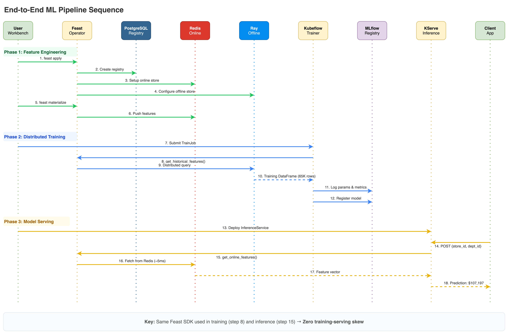

# Sales Demand Forecasting on OpenShift AI

An end-to-end ML pipeline demonstrating distributed feature engineering, model training, and real-time inference on OpenShift AI.

## Use Case

**Retail demand forecasting** predicts weekly sales for store-department combinations using historical sales patterns, temporal features, and economic indicators. Accurate forecasts enable:

- Optimized inventory management
- Reduced stockouts and overstock
- Improved supply chain planning

## Tech Stack

| Component | Technology | Purpose |
|-----------|------------|---------|
| **Feature Store** | Feast + KubeRay | Distributed feature engineering and serving |
| **Training** | Kubeflow Trainer + PyTorch DDP | Multi-node distributed model training |
| **Experiment Tracking** | MLflow | Parameter logging, metrics, model registry |
| **Model Serving** | KServe | Real-time predictions with Feast integration |
| **Infrastructure** | OpenShift AI | Managed ML platform with GPU support |

## Architecture



### Pipeline Flow

```
┌──────────────┐    ┌──────────────┐    ┌──────────────┐    ┌──────────────┐
│   Feature    │    │   Model      │    │   MLflow     │    │   KServe     │
│   Store      │───▶│   Training   │───▶│   Registry   │───▶│   Serving    │
│   (Feast)    │    │   (Kubeflow) │    │              │    │              │
└──────────────┘    └──────────────┘    └──────────────┘    └──────────────┘
       │                   │                   │                   │
       ▼                   ▼                   ▼                   ▼
  PostgreSQL          PyTorch DDP         Experiment         Real-time
  Redis (online)      Multi-GPU           Tracking           Predictions
  Ray (offline)       Training            Model Versions     Feature Lookup
```

## Model Performance

| Metric | Value |
|--------|-------|
| Dataset | 65,520 samples (45 stores × 14 depts × 104 weeks) |
| Features | 22 (lag, rolling, temporal, economic, store metadata) |
| Model | MLP with BatchNorm + Dropout |
| MAPE | ~3-5% |

## Getting Started

For detailed setup instructions on OpenShift AI, see **[GETTING_STARTED.md](GETTING_STARTED.md)**.

### Quick Start

```bash
# 1. Deploy infrastructure
oc apply -k manifests/

# 2. Create workbench (see GETTING_STARTED.md)

# 3. Run notebooks in order:
#    01_feature_store/ → 02_training/ → 03_inferencing/
```

## Documentation

| Document | Description |
|----------|-------------|
| [Getting Started](GETTING_STARTED.md) | OpenShift AI setup, workbench creation |
| [Manifests](manifests/README.md) | Kubernetes/OpenShift deployment manifests |
| [Feature Store](notebooks/01_feature_store/README.md) | Feast notebooks (local/remote modes) |
| [Training](notebooks/02_training/README.md) | Distributed training with Kubeflow |
| [Inference](notebooks/03_inferencing/README.md) | KServe model serving |

## Project Structure

```
sales-demand-forecasting/
├── manifests/                    # Kubernetes manifests
│   ├── base/                     # Namespace, PVC
│   ├── databases/                # PostgreSQL, Redis
│   ├── ray/                      # RayCluster
│   ├── feast/                    # FeatureStore CR
│   └── mlflow/                   # MLflow Operator
├── notebooks/
│   ├── 01_feature_store/         # Feature engineering
│   ├── 02_training/              # Model training
│   └── 03_inferencing/           # Model serving
├── feature_repo/                 # Feast feature definitions
└── docs/                         # Documentation
```

## License

Apache 2.0
