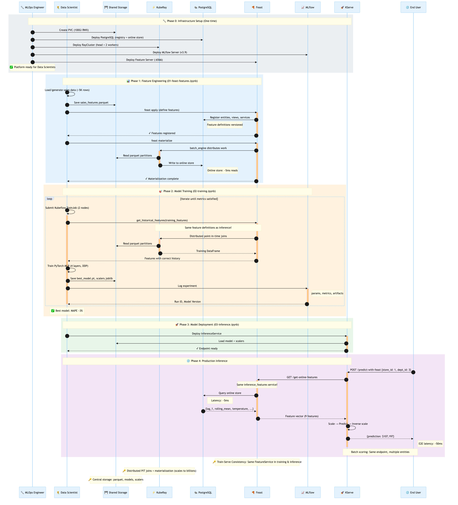

# Feast + Kubeflow Training on OpenShift AI

**Production MLOps: Feature Store → Distributed Training → Inference**



## Overview

This example demonstrates **train-serve consistency** using Feast Feature Services:

- **Training**: `get_historical_features()` via KubeRay (distributed PIT joins)
- **Inference**: `get_online_features()` via Feast Server (low-latency REST API)
- **Same features, zero skew**: Both use the same Feature Service definitions

## Quick Start

### Prerequisites

- OpenShift AI 3.2+ with `trainer`, `workbenches` components
- RWX StorageClass (NFS-CSI or equivalent)
- `kubectl` and `oc` CLI tools

### Option A: Manifests (Production)

```bash
# Deploy infrastructure
kubectl apply -k manifests/

# Wait for pods
kubectl wait --for=condition=ready pod -l app=postgres -n feast-trainer-demo --timeout=120s

# Run data preparation
kubectl apply -f manifests/05-dataprep-job.yaml

# Run training
kubectl apply -f manifests/06-trainjob.yaml

# Deploy inference
kubectl apply -f manifests/08-kserve-inference.yaml
```

### Option B: Notebooks (Interactive)

1. Create **Workbench** in OpenShift AI (PyTorch image, mount PVC at `/shared`)
2. Run notebooks in order:

| Notebook | Purpose |
|----------|---------|
| `01-feast-features.ipynb` | Generate data → `feast apply` → `materialize` |
| `02-training.ipynb` | Submit TrainJob (calls Feast + KubeRay) |
| `03-inference.ipynb` | Test KServe endpoint (real-time + batch) |

## Architecture

```
┌─────────────────────────────────────────────────────────────────┐
│                     E2E MLOps Pipeline                          │
├─────────────────────────────────────────────────────────────────┤
│                                                                 │
│  01-feast-features     02-training          03-inference        │
│  ┌─────────────────┐   ┌─────────────────┐  ┌─────────────────┐ │
│  │ Generate Data   │   │ Kubeflow        │  │ KServe          │ │
│  │ feast apply     │──▶│ TrainJob        │─▶│ InferenceService│ │
│  │ feast materialize│   │                 │  │                 │ │
│  └────────┬────────┘   │ get_historical_ │  │ Feast Server    │ │
│           │            │ features()      │  │ (REST API)      │ │
│           ▼            └────────┬────────┘  └────────┬────────┘ │
│  ┌─────────────────┐            │                    │          │
│  │   PostgreSQL    │◀───────────┴────────────────────┘          │
│  │ • Feast Registry│                                            │
│  │ • Online Store  │                                            │
│  └─────────────────┘                                            │
│                                                                 │
│  ┌─────────────────┐   ┌─────────────────┐  ┌─────────────────┐ │
│  │   KubeRay       │   │    MLflow       │  │   Shared PVC    │ │
│  │ Distributed PIT │   │ Experiment      │  │ /shared/data    │ │
│  │ Joins           │   │ Tracking        │  │ /shared/models  │ │
│  └─────────────────┘   └─────────────────┘  └─────────────────┘ │
└─────────────────────────────────────────────────────────────────┘
```

## Key Integration Pattern

```python
# features.py - Single source of truth
training_features = FeatureService(name="training_features", features=[...])
inference_features = FeatureService(name="inference_features", features=[...])
```

**Training (inside TrainJob):**
```python
store = FeatureStore(repo_path="/shared/feature_repo")
training_df = store.get_historical_features(
    entity_df=entity_df,
    features=store.get_feature_service("training_features"),
).to_df()  # → KubeRay distributes PIT joins
```

**Inference (KServe → Feast Server):**
```python
# POST /v1/models/sales-forecast:predict-with-feast
{"entities": [{"store_id": 1, "dept_id": 3}]}
# → Feast Server fetches from online store
# → Same features as training, zero skew
```

## Project Structure

```
complete-mlops-pipeline/
├── README.md
├── feature_repo/
│   ├── feature_store.yaml      # File-based (apply/materialize)
│   ├── feature_store_ray.yaml  # KubeRay (training)
│   └── features.py             # Feature definitions
├── notebooks/
│   ├── 01-feast-features.ipynb
│   ├── 02-training.ipynb
│   └── 03-inference.ipynb
├── manifests/
│   ├── 00-prereqs.yaml         # Namespace, RBAC
│   ├── 01-postgres.yaml        # PostgreSQL
│   ├── 02-mlflow.yaml          # MLflow Server
│   ├── 03-raycluster.yaml      # KubeRay Cluster
│   ├── 04-feast-prereqs.yaml   # PVC, ServiceAccount
│   ├── 04b-feast-server.yaml   # Feast REST API
│   ├── 05-dataprep-job.yaml    # Data prep Job
│   ├── 06-trainjob.yaml        # Training Job
│   ├── 08-kserve-inference.yaml# KServe Deployment
│   └── kustomization.yaml
└── docs/
    ├── sequence-diagram.png
    ├── 01-features-workflow.png
    ├── 02-training-workflow.png
    └── 03-inference-workflow.png
```

## Configuration

### Ray Integration (Default: Enabled)

| Toggle | Operation | Default | Notes |
|--------|-----------|---------|-------|
| `use_ray` | Training `get_historical_features()` | `true` | KubeRay for distributed PIT joins |
| `use_ray_dataprep` | `feast materialize` | `false` | Enable for large datasets (>1M rows) |

### Two Feast Configs

| Config | Offline Store | Used By |
|--------|---------------|---------|
| `feature_store.yaml` | `type: file` | `feast apply`, `materialize` |
| `feature_store_ray.yaml` | `type: ray` + KubeRay | `get_historical_features()` in TrainJob |

## Results

| Metric | Value |
|--------|-------|
| Dataset | ~5,000 rows (10 stores × 5 depts × 104 weeks) |
| Features | 9 (lag_1/2/4/8, rolling_mean, temp, fuel, CPI, unemployment) |
| Model | MLP [512, 256, 128, 64] |
| Best MAPE | ~3% |
| Training Time | ~2-3 min (with Ray feature retrieval: ~11 min) |

## Cleanup

```bash
kubectl delete namespace feast-trainer-demo
```

## Resources

- [Feast Documentation](https://docs.feast.dev/)
- [Feast Ray Integration](https://docs.feast.dev/reference/offline-stores/ray)
- [Kubeflow Training Operator](https://www.kubeflow.org/docs/components/training/)
- [OpenShift AI Documentation](https://access.redhat.com/documentation/en-us/red_hat_openshift_ai_self-managed/)
